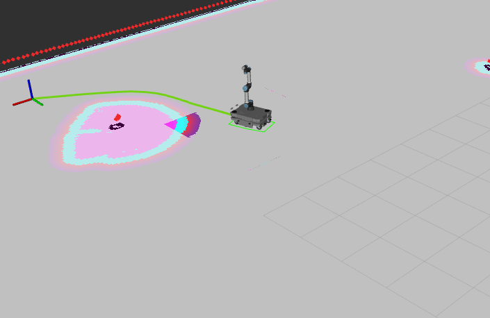
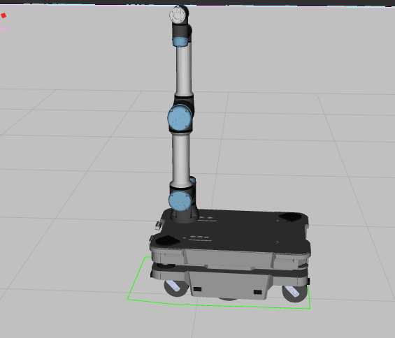

# Mobile Manipulator Navigation — MiR250 + UR5e




A ROS 2 navigation stack for a **MiR250 mobile base carrying a UR5e arm**, integrated and validated in simulation. The two robots are merged into a single description with one coordinate tree and one controller manager, and the navigation stack is extended so the robot reasons about its **changing footprint** as the arm moves, detects **overhead obstacles** the lasers cannot see, and reacts to **close-range obstacles** on every side.

---

## Overview

A mobile manipulator is not two robots sharing a space — it is a single machine whose shape and perception needs come from both parts at once. The arm raises the effective footprint above the laser plane, and the working environment contains overhangs (tables, shelves) whose dangerous parts sit exactly in that unseen region. This project addresses that with four pieces of work:

- **A unified robot.** The MiR250 and UR5e are combined into one description with consistent naming prefixes (`mir/` and `ur_`), joined by a fixed link from the base top plate to the arm root, producing one continuous coordinate tree and a single control layer.
- **A dynamic footprint.** A node projects the arm onto the ground each cycle and publishes the convex hull of the base-plus-arm as the live Nav2 footprint, so narrow gaps are usable when the arm is folded and avoided when it extends.
- **Depth-camera perception.** Two forward-facing depth cameras feed the voxel layer of the local costmap, turning 3D points into 2D cost so overhanging obstacles are avoided.
- **Proximity sensors.** Eight short-range sensors around the chassis feed a dedicated range-sensor layer for close-in obstacle avoidance.

A separate study (see the project report) compares the Nav2 local planners and motivates the choice of controller.

---

## Requirements

- **ROS 2 Humble**
- **Gazebo Classic** with `gazebo_ros2_control`
- **Nav2** (`nav2_bringup`, `nav2_amcl`, costmap plugins incl. `RangeSensorLayer`)
- `slam_toolbox` (only for building maps; not needed at navigation time)
- A built and sourced workspace:

```bash
cd ~/Desktop/Project/M_U
colcon build --symlink-install
source install/setup.bash
```

Source the workspace in **every** terminal before running the commands below.

---

## How to Run

The system is brought up across four terminals. Start them in order and wait for each to settle before launching the next.

**1 — Simulation + merged robot.** Brings up Gazebo with the chosen world and spawns the merged MiR250 + UR5e as a single entity, with one robot_state_publisher and one controller manager.

```bash
ros2 launch merged merged.launch.py world:=maze2
```

**2 — Localization (AMCL).** Loads the pre-built map and starts AMCL, which provides the `map → odom` correction.

```bash
ros2 launch mir_navigation amcl.py use_sim_time:=true \
  map:=$(ros2 pkg prefix mir_navigation)/share/mir_navigation/maps/maze2.yaml
```

**3 — Navigation (Nav2).** Starts the planner, controller, costmaps, and behaviour tree.

```bash
ros2 launch mir_navigation navigation.py use_sim_time:=true
```

**4 — Dynamic footprint.** Publishes the live footprint polygon to the costmaps as the arm moves.

```bash
ros2 run merged arm_footprint_projector
```

Once all four are running, set an initial pose (if AMCL has not converged) and send a goal from RViz to navigate.

> **`use_sim_time` must be `true`** for the navigation and localization launches so they use Gazebo's clock. Mismatched clocks silently drop stamped data and break localization in subtle ways.

---

## Worlds and Maps

The default test world is **`maze2`** — two rooms joined by a tight doorway, with two tables whose wide tops overhang narrow bases (visible to the cameras, invisible to the lasers). Pass a different world with `world:=<name>` to terminal 1, and point AMCL at the matching map in terminal 2.

Maps are built **once, offline** with `slam_toolbox` by driving the robot through the world, then saved with the map saver and reused on every later run. Note that overhanging tabletops do **not** appear in the saved map (the mapping lasers never see them) — detecting them at runtime is the cameras' job.

---

## How It Fits Together

| Component | Role |
|---|---|
| `merged` | The combined robot description, simulation launch, and the dynamic-footprint node |
| `mir_navigation` | AMCL, Nav2 parameters and launch, and the maps |
| **Dynamic footprint** | Subscribes to `/joint_states`, projects the arm via TF, publishes the convex-hull polygon to both costmaps' footprint topics |
| **Depth cameras** | Feed the **voxel layer** of the **local** costmap (3D → 2D cost; overhead detection) |
| **Proximity sensors** | Feed a dedicated **range-sensor layer** (close-range avoidance) |

A few design points worth knowing before changing the configuration:

- **The static footprint and `robot_radius` are removed from the Nav2 YAML on purpose.** With no fixed footprint defined, the costmaps fall back to the live footprint topic, making the dynamic polygon the sole source. Re-adding a fixed value would silently override it.
- **Cameras are in the local costmap only.** A full 3D voxel layer over the large global map is too expensive; the rolling local window keeps it cheap. If global overhead-awareness is ever needed, project the cloud to a **2D obstacle layer** for the global costmap rather than extending the voxel layer.
- **Proximity sensors need their own layer.** The voxel layer rejects simple `Range` messages, so the sensors use `RangeSensorLayer` instead.
- **Naming prefixes are mandatory.** Both robots ship with generic frame names (e.g. `base_link`); without the `mir/` and `ur_` prefixes the merged coordinate tree breaks silently.

---

## Simulation vs. Real Hardware

The stack is identical to a real deployment everywhere above the hardware interface — moving to the physical robot swaps only the hardware component beneath `ros2_control`. Two intentional differences from the real MiR are worth noting:

- The model's proximity sensors are modelled **horizontally for normal navigation**, feeding the costmap. The real MiR's sensors are angled at the floor and trigger a **hardware motor cut-off**; that emergency-stop behaviour is deliberately **not** modelled here.
- The cameras' exact mounting position is not given in the datasheet; a sensible forward-facing placement is used and can be moved if a precise mount is specified.

---

## Documentation

The full design, integration, and validation write-up — including the planner comparison study — is in the project report (`Mobile_Manipulator_Navigation_Full_Report.pdf`).

---

## License and Attribution

The MiR250 base description, drivers, and original packages are due to [giangalv](https://github.com/giangalv/MIR_250), and the UR5e arm description and control are due to the [Universal_Robots_ROS2_Driver](https://github.com/UniversalRobots/Universal_Robots_ROS2_Driver). This repository is an integration and extension workspace that merges the two robots and builds a navigation stack on top of them; it does not claim authorship of the original robot packages. Upstream code retains its original license.

Project-specific additions — the merged robot description, the dynamic-footprint node, the depth-camera and proximity-sensor integration, the Nav2 configuration, the test worlds and maps, and the documentation — are released under the license declared at the repository root.
